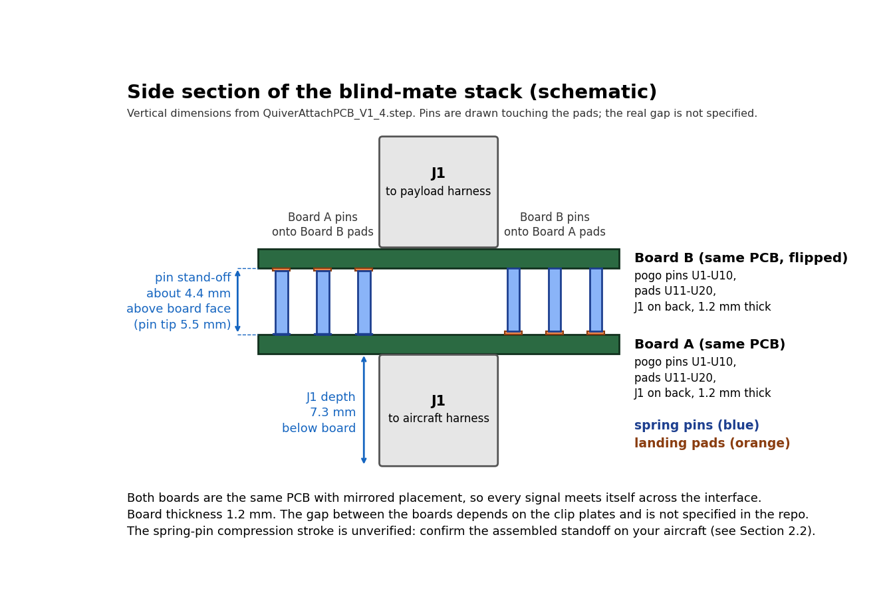

# Attachment Developer Guide

If you are designing or building a hardware attachment for Quiver, this guide covers everything you need: how the attachment mounts to the airframe, what off-the-shelf parts to order, how the electrical connectors mate, and how to safely wire power, CAN, PWM, and Ethernet.

This guide covers the mechanical and electrical attachment interface, plus the payload software handoff.

The interface contract itself is the payload-systems [Interface Control Document (ICD)](https://github.com/Arrow-air/payload-systems/blob/main/interface/ICD.md); this guide links it and adds the pin tables, power rules, and field detail a builder needs. Software is covered in the [SDK Developer Guide](./Quiver-SDK-Developer-Guide.md). Flight-controller parameters and the network layout come from the [Initial Configuration Guide](https://github.com/Arrow-air/project-quiver/blob/errrks-init-config-1/docs/Operations/Initial-Configuration-Guide.md); relay labels come from the [Pilot Handbook](../Operations/Pilot-Handbook.md) §2.8.5.

---

## Quick Start: The Mental Model

Use the board routing and CAD geometry below as design references. Verify fit, electrical levels, protocol compatibility, and load limits on the aircraft before flight:

- the attachment uses the JMRRC quick-release clamp (BOM 2112) and its associated spacers,
- each bay uses the same pogo-pin contact interface, but the aux line is different per bay,
- all three bays share the same CAN2 bus, and all three share the same switched 12V payload rail,
- the bottom bay has an extra dedicated `12VSW` motor line,
- the high-power path is the switched HV line on the Main PCB, not the shared 12V payload rail.

The electrical design described here is for Main PCB V1.2 and Attachment Interface PCB V1.4. Design files describe intended routing and geometry; they do not certify a completed aircraft-level test.

### Builder-First Summary

A payload developer should be able to determine:

- the payload bay layout and where the three ports sit on the aircraft,
- the PCB dimensions present in the current KiCad layout and the attachment CAD assembly placement,
- what the payload-side board looks like and how the pogo-pin / landing-pad pairing works,
- the bay-by-bay electrical contract for power, CAN, PWM, and Ethernet,
- which interface details are fixed by the board design and which require aircraft-level verification.


*Figure 1: Project Quiver multirotor drone.*

### The Drone

The [project README](../index.md) describes Quiver as an **open-source, modular quadcopter platform for developers and operators**. It has a 25 kg MTOW and three quick-release attachment interfaces: bottom, left, and right. The README advertises 5-8 kg payload capacity; per-port payload mass, empty-airframe weight, and battery weight are not documented (see issue #209).
- **Bottom Bay:** Facing straight down under the fuselage.
- **Side 1 Bay (Right / Starboard):** Facing outward to the right.
- **Side 2 Bay (Left / Port):** Facing outward to the left.

Each bay uses the same mechanical interface and contact layout; auxiliary signals differ by bay, and the bottom bay alone has the additional `12VSW` rail.

### How an Attachment Mates

Connecting an attachment to Quiver involves two parts: a mechanical clamp and an Attachment Interface PCB.

1. **Mechanical Interface:** The aircraft uses BOM 2112 quick-release interface plates. Confirm the payload-side mating dimensions and fasteners against the hardware you will install; this guide does not specify a clamp load rating.
2. **Pogo-Pin Contact Interface:** The Attachment Interface PCB has spring-loaded contact positions (`U1` to `U10`) and corresponding pad positions (`U11` to `U20`). The aircraft side uses pins; the payload side uses pads.
3. **Internal Wiring:** **Do not solder or wire to the pogo pins or landing pads.** The payload-side PCB has a 12-pin locking Molex connector (**J1**) on its back face. Connect payload sensors, servos, cameras, and controllers through this connector using a wire harness.

```
[ AIRCRAFT AIRFRAME ]
         │
         ▼
[ PETG Spacer ]                (side spacers; wiring notch on bottom spacer)
         │
         ▼
[ Quick-Release Interface ]    (BOM 2112; aircraft-side CAD model)
         │
 [ Aircraft PCB ]              (Populated with male Pogo Pins U1 to U10)
═════════╪══════════════════════════════════════════════════════════════════ POGO-PIN / PAD CONTACT INTERFACE
[ Payload PCB ]               (Payload-side board; populated with flat pads U11 to U20)
         │
         ▼
[ Payload Mounting Plate ]     (mating hardware dimensions per current supplier drawing)
         │
 [ Molex J1 Header ]           (12-pin locking header on rear of Payload PCB)
         │
         ▼
[ Your Payload Wire Harness ]  (Mates with Molex 2045231201 plug)
         │
         ▼
[ YOUR PAYLOAD HARDWARE ]
```

### Key Terms

> [!IMPORTANT]
> Board routing and nominal geometry below describe Main PCB V1.2 and Attachment Interface PCB V1.4. Verify operating behavior, mating fit, and electrical limits on the specific aircraft.

| Term | What It Means |
|---|---|
| **Attachment Interface PCB** | The compact 23.5 x 15.8 mm board ([`QuiverAttachPCB`](../../src/pcb/attach_pcb/QuiverAttachPCB.kicad_pcb)) that sits inside the quick-release plate. |
| **Pogo Pins (`U1` to `U10`)** | Spring-loaded pins on the **drone-side** board (part `C2826546`). |
| **Landing Pads (`U11` to `U20`)** | Flat circular copper pads on the **payload-side** board that contact the drone pogo pins. |
| **Molex J1** | The 12-pin locking connector (Molex part 2077601281) on the back of the payload board. This is where your harness plugs in. |
| **CAN2** | All three payload bays are routed to CAN2, the 500 kbit/s radar bus shared with the two NanoRadar sensors. Attachments do not share a bus with the ESCs, GNSS, or Remote ID. The bitrate and protocols are set in the flight controller configuration (`CAN_P2`), not by the PCB. |
| **CAN protocols and IDs** | CAN2 driver slots are configured with `CAN_D2_PROTOCOL = 1` and `CAN_D2_PROTOCOL2 = 14`; these are protocol-selection values, not protocol numbers. The NanoRadar sensors use raw CAN IDs 1 and 2; those are not DroneCAN node IDs. Follow the configuration brief's ID reservation and validate coexistence on the aircraft. |
| **FMU** | Flight Management Unit (the ArduPilot flight controller). Each bay has a routed FMU signal net; waveform and output configuration require aircraft-specific verification. |
| **Switched 12V (`+12V_PL`)** | The shared 12V payload power rail (pin 10 on Molex J1), switched by SSR K2 (CPC1019N) driving MOSFET Q2, controlled via `FMU_CH4`. The F8 hold rating implies about 13W at nominal 12V; this is an estimate, not a measured system budget. |
| **Motor 12V (`12VSW`)** | A secondary 12V line on the **bottom bay only** (pins 2 and 4 on Molex J1). SSR K1 controls MOSFET Q1, which switches regulated `+12V` onto this line; K1 is controlled via `FMU_CH2`. Dedicated to the brush bullet DC motor payload. |
| **Switched HV (`J26`)** | Switched flight-battery power from a dedicated 2-pin connector on the Main PCB, controlled by `IO_CH7` through K3/Q3. Select the power path using measured payload demand and aircraft limits; the board files do not establish a 13 W crossover. |

---

## 1. What is a Quiver Attachment?

A Quiver attachment is a hardware module mounted at one of the three bay locations on the drone:

| Bay Location | Physical Position | Facing Direction | Port-Specific Features |
|---|---|---|---|
| **Bottom** | Underside of lower chassis plate | Facing straight down (-Z) | Aux signal `FMU_CH1` (servo output 9); the only bay with the `12VSW` line |
| **Side 1 (Right)** | Starboard battery wall | Facing outward right (+X) | Aux signal `FMU_CH7` (servo output 15) |
| **Side 2 (Left)** | Port battery wall | Facing outward left (-X) | Aux signal `FMU_CH8` (servo output 16) |

The bays are otherwise electrically identical, so choose a bay by the aux channel and the `12VSW` line you need, not by payload type.

**Existing builds.** The August meetup produced a servo latch, a multispectral camera, and a Starlink Mini. Their reported integration details are in [§9.1](#91-build-notes); these reports are not aircraft-level qualification. Six additional payload concepts have requirement documents: cargo, lidar, machine vision, camera, stabilized carrier, and floodlight (see [payload-systems](https://github.com/Arrow-air/payload-systems) and the [attachment requirements](../../task-grant-bounty/equipment/attachment/0002-detailed_attachment_requirement_for_bounty/information-note.md)).

The mechanical quick release does not establish that electrical connections may be made or broken while powered. See [§6.3](#63-arming-disarming-and-hot-swap-rules) before handling a powered aircraft.

### Where the Bays Sit on the Aircraft

The three bays are integrated into the fuselage structure:

| Rear View (Bay Locations) | Side View (Port Offsets) |
|:---:|:---:|
|  |  |
| *Figure 2: Payload bays viewed from the rear. Origin is at the airframe centre; image right is aircraft right (+X). Orange denotes attachment interface hardware.* | *Figure 3: Payload bays viewed from the side.* |

Figure 3's green region and dimensions are CAD-derived illustrations, not a validated payload clearance envelope. Check the current aircraft assembly and installed hardware before setting payload dimensions.


*Figure 4: Oblique view from below and rear-left. Orange indicates the quick-release plate and spacer; the green Attachment Interface PCB is visible at the left bay. The right-side bay is hidden behind a leg.*

### Practical Rules Before You Build

- **Live Connection:** Live attachment or removal is not established as a tested operating procedure here. Keep the aircraft unpowered unless live connection has been specifically tested and approved for that aircraft and payload.
- **Example Integration Patterns:** An actuator may use a bay aux signal and its own local regulation; a data payload may use the routed CAN or Ethernet pairs. Confirm protocol compatibility, signal levels, power draw, and physical fit on the actual assembly before flight.

---

## 2. Mechanical Interface

This chapter describes the attachment plate, bay locations, spacers, and mating PCB dimensions. Values that require aircraft-level measurement are marked for verification.

### 2.1 Coordinate Frame and Bay Locations

The coordinates below are the placement points used for the three attachment-plate CAD models. They are model placement coordinates, not mounting-hole centers or validated clearance limits.

Quiver uses standard aircraft coordinates with the origin `(0, 0, 0)` at the center of the fuselage interior:
- **+X:** To the right (Starboard)
- **+Y:** Forward toward the nose
- **+Z:** Upward toward the top lid

```
                        +Z (Up)
                           ▲
                           │
       Side 2 (Left)       │       Side 1 (Right)
       [-X bay]            │            [+X bay]
      [===]──────────[ FUSELAGE ]──────────[===]
                           │
                           │
                           ▼ -Z (Down)
                         [===]
                      Bottom bay
```

| Bay | Plate Model Center-of-Mass Placement (X, Y, Z) | Facing Direction in Assembly | Mounting Hardware on Aircraft |
|---|---|---|---|
| **Bottom** | `(0.00, 0.00, -160.70) mm` | Down (-Z) | Assembly includes spacer `2131` and interface plate `2112` |
| **Side 1 (Right)** | `(+185.65, -0.02, -71.00) mm` | Right (+X) | Assembly includes spacer `2111` and interface plate `2112` |
| **Side 2 (Left)** | `(-185.65, +0.02, -71.00) mm` | Left (-X) | Assembly includes spacer `2111` and interface plate `2112` |

An approximate overview datum also places interfaces at X = ±150 mm and Z = -125 mm; its relationship to the model placement points above is unspecified. Use the aircraft CAD assembly to establish the datum before designing clearances.

### 2.2 Drone-Side Hardware and Spacers

The aircraft uses three quick-release interface plates (2112), two side spacers (2111), and one bottom spacer (2131). Payload mass rating and clearance envelope are not specified here; verify both for the installed aircraft.

The builder should be able to answer these questions from this section alone:
- what the payload side and drone side mating hardware look like,
- which spacer is used at each bay,
- what the thickness and envelope are,
- whether the bottom or side bays have a different wiring exit requirement.

The assembly uses PETG spacers at the attachment locations:

| Bottom Interface Assembly | Side Interface Exploded View |
|:---:|:---:|
|  |  |
| *Figure 5a: Bottom interface assembly showing the wire notch.* | *Figure 5b: Side interface exploded view showing the 30 mm spacer.* |

- **Side Ports (Right and Left):** Each side bay uses spacer `2111` ([`2111_attach_spacer.step`](../../src/quiver/supporting_structure/attachment_interface/steps/2111_attach_spacer.step)). Confirm the assembled standoff against the aircraft before setting the payload envelope.
- **Bottom Port:** The bottom bay uses spacer `2131` ([`2131_attach_spacer_bottom.step`](../../src/quiver/supporting_structure/attachment_interface/steps/2131_attach_spacer_bottom.step)), which has a wiring notch.

| Side Spacer (`2111_attach_spacer`) | Bottom Spacer with Notch (`2131_attach_spacer_bottom`) |
|:---:|:---:|
|  |  |

### 2.3 JMRRC Quick-Release Clamp (BOM 2112)

Part 2112 is the JMRRC aluminum quick-release clamp used at all three bays. The payload-systems [mechanical README](https://github.com/Arrow-air/payload-systems/blob/main/interface/mechanical/README.md) identifies the payload-side clip plate as a 50 x 50 mm footprint, 10.5 mm thick, ordered without a PCB, and places its mounting plane near Z = -171 mm. Confirm dimensions and datum against the hardware and aircraft assembly you will use. No load rating is specified.


*Figure 6: JMRRC quick-release clamp assembly (BOM 2112).*

Determine payload-side mating geometry, fasteners, thickness, and load limits from the actual hardware before designing the attachment. The mechanical-only [RAM-ball C design](https://github.com/Arrow-air/payload-systems/blob/main/payloads/ram-ball-c/README.md) specifies four Ø3 mm holes on a 38 x 38 mm square pattern (centers at X/Y = +/-19 mm) and a 16 x 24 mm shaft. Check those dimensions against the selected hardware revision.

### 2.4 Attachment Interface PCB Dimensions

This section describes the current V1.4 Attachment Interface PCB layout. Confirm the supplied payload-side assembly and mechanical fit before manufacturing an attachment.

The electrical connection is made by the **Quiver Attachment Interface PCB** ([`src/pcb/attach_pcb/QuiverAttachPCB.kicad_pcb`](../../src/pcb/attach_pcb/QuiverAttachPCB.kicad_pcb)); verify its installed position using the current mechanical assembly:


*Figure 7: PCB layout dimensions and edge-cut hole pattern. Right-side labels show the 2.54 mm pin-row pitch and 5.00 mm offset between aircraft pins and payload pads.*

- **Outer Dimensions:** 23.50 mm wide x 15.80 mm high.
- **Board Thickness:** **1.20 mm FR4**, as specified by the current KiCad layout. Confirm receiving-pocket clearance against the current mechanical assembly.
- **Edge-Cut Holes:** 4 circular cut-outs arranged in a rectangle:
  - Horizontal spacing (X axis): **20.00 mm** center-to-center.
  - Vertical spacing (Y axis): **8.00 mm** center-to-center.
  - KiCad board coordinates: `(100.0, 129.0)`, `(120.0, 129.0)`, `(100.0, 137.0)`, `(120.0, 137.0)`.
  - The KiCad outline defines the holes as 2.00 mm diameter; it does not specify threaded holes or fasteners.
- **Orientation:** The board outline has chamfered corners and a silkscreen orientation notch. Confirm the payload board orientation against the aircraft-side board before mating.


*Figure 8: Rear face of the payload board showing the 12-pin Molex J1 connector.*

### 2.5 How the Boards Mate vs. How You Wire


*Figure 9: Cross-section showing drone pogo pins contacting payload pads, and your harness connecting to Molex J1.*

A single board design serves both sides of the interface by populating different parts:

| Drone-Side Board | Payload-Side Board |
|---|---|
| Populated with 10 male spring-loaded pogo pins (`U1` to `U10`, part `C2826546`). | Populated with 10 flat circular copper landing pads (`U11` to `U20`, 2.0 mm diameter). |
| The pogo pins face outward toward the docking bay. | The landing pads face inward toward the aircraft. |
| Rear Molex J1 connects to the aircraft internal avionics harness. | Rear Molex J1 connects to your payload internal electronics. |

The PCB design is the same for both sides; the payload-side board is mirrored in placement but not in fabrication.

| Physical PCB: Mating Face | Physical PCB: Rear Connector Face |
|:---:|:---:|
|  |  |

> [!WARNING]
> **Wiring rule:** The aircraft-side board uses spring-loaded pins U1–U10; the payload-side board uses copper pads U11–U20. Connect payload wiring through Molex J1, not directly to the contacts.

### 2.6 Open Mechanical Items

These values are not documented anywhere yet. They are marked open here rather than estimated:

- **Empty weight, battery weight, and maximum payload mass:** requested in issue #209; pending a bench weigh-in.
- **Structural load limits per port (side versus bottom):** no rating exists; pending CAD or FEA analysis. Do not assume a limit.
- **Pogo pad coordinates and a mechanical drawing:** defined only in the V1.4 KiCad project today; this guide does not reproduce them.

For the mating mechanics, the ICD (§6) and the STEP files and mounting coordinates under [`interface/mechanical/`](https://github.com/Arrow-air/payload-systems/tree/main/interface/mechanical) in payload-systems are the reference.

---

## 3. Electrical Contract

This section summarizes routing in the current board designs and separates it from firmware configuration and system behavior that require separate validation. The interface contract is the payload-systems [ICD](https://github.com/Arrow-air/payload-systems/blob/main/interface/ICD.md) (§2 to §5); where this guide differs from the ICD, it says so.

The current design references are the board layouts and schematics for the Main PCB and Attachment Interface PCB:
- Main PCB: [`Quiver_PT3_Main_PCB-rounded.kicad_pcb`](../../src/pcb/main_pcb/Quiver_PT3_Main_PCB-rounded.kicad_pcb) and [`Quiver_PT3_Main_PCB-rounded.kicad_sch`](../../src/pcb/main_pcb/Quiver_PT3_Main_PCB-rounded.kicad_sch)
- Attachment Interface PCB: [`QuiverAttachPCB.kicad_pcb`](../../src/pcb/attach_pcb/QuiverAttachPCB.kicad_pcb) and [`QuiverAttachPCB.kicad_sch`](../../src/pcb/attach_pcb/QuiverAttachPCB.kicad_sch)

The ICD is the interface overview, but several details in its current draft conflict with the board and configuration sources. It calls the `+12V_PL` switch U5 and K1 a mechanical relay, describes about 25 W per port and says the rail is enabled by default, and calls the V1.4 spring-pin mate electrically validated. Main PCB V1.2 instead uses K2 (CPC1019N) to drive Q2 for `+12V_PL`, and K1 (CPC1019N) to drive Q1 for `12VSW`; F8's 1.10 A hold rating corresponds to about 13 W nominal across the shared rail, not per port. The [configuration baseline](https://github.com/Arrow-air/project-quiver/blob/errrks-init-config-1/docs/Operations/Initial-Configuration-Guide.md) leaves relay outputs unconfigured, and the [V1.4 update note](../../task-grant-bounty/pt3/electronics/0003-Attachment-Interface-PCB/2026-Update/information-note.md) lists electrical validation as an open action. Use the board files for routing and the aircraft's parameter readback for runtime behavior.

### 3.1 Port Capability Matrix

The three bays share power and CAN, but have different auxiliary lines:

| Capability | Bottom Bay | Side 1 / Right Bay | Side 2 / Left Bay | Details |
|---|---|---|---|---|
| **Main 12V Rail (`+12V_PL`)** | **Switched** (K2→Q2) | **Switched** (K2→Q2) | **Switched** (K2→Q2) | Main PCB layout and schematic |
| **Motor 12V Rail (`12VSW`)** | **Switched** (+12V via Q1; K1 controlled by `FMU_CH2`) | **No Connect (NC)** | **No Connect (NC)** | Main PCB layout and schematic |
| **CAN pair routing** | **CAN2** | **CAN2** | **CAN2** | Main PCB layout; verify bitrate and protocol against aircraft configuration |
| **Ethernet pairs** | Routed via J39 to onboard switch | Routed via J37 to onboard switch | Routed via J38 to onboard switch | Main PCB layout and schematic |
| **FMU Aux signal net** | `FMU_CH1` | `FMU_CH7` | `FMU_CH8` | Main PCB layout and schematic |
| **Avionics Header** | `J31` (PTSM 1814951) | `J29` (PTSM 1778735) | `J30` (PTSM 1778735) | [`Quiver_PT3_Main_PCB-rounded.kicad_pcb`](../../src/pcb/main_pcb/Quiver_PT3_Main_PCB-rounded.kicad_pcb) |
| **Ethernet Header** | `J39` (PTSM 1814935) | `J37` (PTSM 1778719) | `J38` (PTSM 1778719) | Main PCB layout and schematic |
| **Recommended payload IP** | `192.168.144.100` | `192.168.144.101` | `192.168.144.102` | Static address; match the installed bay |

### 3.2 Main PCB Payload Headers (J29, J30, J31) and Ethernet Connectors (J37, J38, J39)

On the aircraft's Main PCB, each payload bay connects to a 6-pin Phoenix Contact PTSM connector for power, CAN, and FMU signals, and to a separate 4-pin Phoenix Contact PTSM Ethernet header routed to an onboard switch:

| Bay | Avionics Header (power + CAN + FMU) | Ethernet Header |
|---|---|---|
| **Bottom** | `J31` (PTSM `1814951`, 6-pin) | `J39` (Phoenix PTSM `1814935`, 4-pin) |
| **Side 1 (Right)** | `J29` (PTSM `1778735`, 6-pin) | `J37` (PTSM `1778719`, 4-pin) |
| **Side 2 (Left)** | `J30` (PTSM `1778735`, 6-pin) | `J38` (PTSM `1778719`, 4-pin) |

The avionics (J29/J30/J31) and Ethernet (J37/J38/J39) headers are internal to the aircraft harness; your attachment only sees the signals arriving at Molex J1 on the Attachment Interface PCB. Payload Ethernet is 100BASE-TX over pairs A and B only (the two pairs on Molex J1 pins 1, 3, 5, and 7), so gigabit operation is not available at the payload ports.

**Avionics headers pinout (J29, J30, J31):**

| Pin | Bottom Bay (`J31`) Net | Side 1 Bay (`J29`) Net | Side 2 Bay (`J30`) Net | Function |
|:---:|---|---|---|---|
| **1** | `GND` | `GND` | `GND` | Ground reference |
| **2** | `+12V_PL` | `+12V_PL` | `+12V_PL` | Shared switched 12V payload rail (K2 controls Q2) |
| **3** | `/CAN2_L` | `/CAN2_L` | `/CAN2_L` | CAN2 Low; verify bitrate and protocol on aircraft |
| **4** | `/CAN2_H` | `/CAN2_H` | `/CAN2_H` | CAN2 High; verify bitrate and protocol on aircraft |
| **5** | `/FMU_CH1` | `/FMU_CH7` | `/FMU_CH8` | FMU signal net; verify output function and electrical levels |
| **6** | `/12VSW` | *No Connect* | *No Connect* | Switched regulated 12V motor line (**Bottom bay only**; Q1 controlled by K1) |

The current Main PCB layout defines these pins on J31, J29, and J30. Signal names are shown without KiCad-internal net numbers, which can change between revisions.

### 3.3 Payload Harness Connector: Molex J1 Pinout

The **12-pin Molex connector (J1)** on the back of your payload board is where your attachment wiring connects:
- **Board Header (J1):** Molex part [`207760-1281`](https://www.molex.com/en-us/products/part-detail/2077601281) (Micro-Lock Plus, 12-circuit, dual-row, 1.25 mm pitch, vertical surface-mount locking header; rated 2.0 A per contact and 50 V maximum by Molex).
- **Mating Cable Plug:** Molex housing `204523-1201`; the [harness manufacturing guide](../../task-grant-bounty/pt3/electronics/0009-Harnessing-Guide/Harnessing-Guide.md) lists terminal `2145291000` and pre-crimped lead `79758-1149`. Check the ratings for the selected terminal and wire as well as the header: the lowest-rated part sets the limit.

| Pin | Signal Name | Type | Electrical Rating | Description |
|:---:|---|---|---|---|
| **1** | `ETH_RX+` | Input | Ethernet pair | Ethernet Receive positive (from the onboard Ethernet switch) |
| **2** | `12VSW` | Power | +12V DC, 2A fused | **Bottom bay only:** Q1-switched regulated 12V line for the brush bullet motor. K1 controls Q1; F1 protects the line. Unconnected on Side 1 and Side 2. |
| **3** | `ETH_RX-` | Input | Ethernet pair | Ethernet Receive negative (from the onboard Ethernet switch) |
| **4** | `12VSW` | Power | +12V DC, 2A fused | Paralleled with pin 2 for extra current handling (Bottom bay only). |
| **5** | `ETH_TX+` | Output | Ethernet pair | Ethernet Transmit positive (to the onboard Ethernet switch) |
| **6** | `GND` | Ground | 0V Reference | Power and signal ground return |
| **7** | `ETH_TX-` | Output | Ethernet pair | Ethernet Transmit negative (to the onboard Ethernet switch) |
| **8** | `GND` | Ground | 0V Reference | Power ground return (doubled pin for current capacity) |
| **9** | `CAN_L` | I/O | CAN low | Aircraft **CAN2_L**. *(Board silkscreen says `CAN1_N`)* |
| **10** | `+12V` | Power | +12V DC; F8 1.10A hold | Main switched payload rail `+12V_PL` (K2 controls Q2; `12V Pay`) |
| **11** | `CAN_H` | I/O | CAN high | Aircraft **CAN2_H**. *(Board silkscreen says `CAN1_P`)* |
| **12** | `FMU_AUX` | I/O | FMU signal; verify voltage and waveform on aircraft | Bay auxiliary net: **Bottom:** `FMU_CH1`, **Side 1:** `FMU_CH7`, **Side 2:** `FMU_CH8` |

*(Molex J1 signal and pin mapping.)*

> [!NOTE]
> **Doubled pins are doubled on J1 only.** The mating plane has a single contact each for `12VSW` (`U2`) and `GND` (`U4`), so the paralleled J1 pins (2 and 4, 6 and 8) do not add current capacity across the pogo interface. This guide does not specify the pogo-pin current rating; check the `C2826546` datasheet before loading those contacts. The J1 50 V rating is below full battery voltage; the HV tap is on Main PCB J26, not on this interface.

### 3.4 Pogo Pin and Landing Pad Map

When you check electrical continuity with a multimeter, here is how the 10 contact pads across the mating plane match up:

| Signal Name | Drone Pogo Pin (`U1` to `U10`) | Payload Landing Pad (`U11` to `U20`) | Mated Signal Function |
|---|:---:|:---:|---|
| `ETH_RX+` | `U1` | `U11` | Ethernet RX+ differential line |
| `12VSW` | `U2` | `U12` | Switched DC motor rail (Bottom bay only; NC on sides) |
| `ETH_RX-` | `U3` | `U13` | Ethernet RX- differential line |
| `GND` | `U4` | `U14` | System ground reference |
| `ETH_TX+` | `U5` | `U15` | Ethernet TX+ differential line |
| `+12V` | `U6` | `U16` | Main switched 12V payload rail (`+12V_PL`) |
| `ETH_TX-` | `U7` | `U17` | Ethernet TX- differential line |
| `FMU_AUX` | `U8` | `U18` | Auxiliary PWM/GPIO (`FMU_CH1` / `FMU_CH7` / `FMU_CH8`) |
| `CAN_H` | `U9` | `U19` | Vehicle CAN2 high pair |
| `CAN_L` | `U10` | `U20` | Vehicle CAN2 low pair |

*(Contact designators and corresponding signals.)*

### 3.5 Network and Ethernet Routing


*Figure 10: Quiver network routing showing Ethernet switches and CAN separation.*

The Main PCB design routes the payload's Ethernet pairs through two switch modules. The payload port is 100BASE-TX over pairs A and B only, so its design limit is 100 Mbit/s:
- **Designed routing:** Bottom J39 and Side 1 J37 connect to switch module J47; Side 2 J38 connects to J51.
- **Aircraft status:** The initial aircraft configuration removed the GigaBlox switches on 2026-08-24 because they interfered with the M9N GNSS receiver. Payload Ethernet is therefore unavailable on that aircraft unless the switches are restored and GNSS coexistence is validated.
- **Wiring to the Bay:** The harness carries the `ETH_TX` and `ETH_RX` pairs to pins 1, 3, 5, and 7 on Molex J1.

### 3.6 CAN Bus Architecture

The Main PCB design uses two CAN nets; the payload connectors are routed to CAN2:

1. **CAN1:** The payload connector nets are not on CAN1, so an attachment never shares a bus with the ESCs, GNSS, or Remote ID.
2. **CAN2:** Bottom J31, Side 1 J29, and Side 2 J30 route to `/CAN2_H` and `/CAN2_L`. CAN2 is the 500 kbit/s radar bus and is shared with the two NanoRadar sensors.
  - CAN2 protocol selection uses driver slots: `CAN_D2_PROTOCOL = 1` and `CAN_D2_PROTOCOL2 = 14`. These are protocol-selection values, not protocol numbers. The radar devices use raw CAN IDs 1 and 2, not DroneCAN node IDs. Keep DroneCAN node IDs 1 and 2 reserved as directed by the configuration brief, and validate coexistence on the aircraft.
  - Before flight, verify that your node enumerates, that the radars still report, and that the bus rate and wiring are correct.

> [!NOTE]
> **CAN label mapping:** The attachment-board labels are `CAN1_P` and `CAN1_N`; at all three aircraft payload ports these conductors connect to Main PCB `CAN2_H` and `CAN2_L`.

- **Bus Termination:** CAN2 is terminated on the Main PCB by a 120 ohm resistor (R14) that slide switch S2 connects across CAN2_H and CAN2_L. Do not add termination inside an attachment.

### 3.7 Power Delivery and Switching Rules

There is no always-on, direct battery feed on the attachment connectors. Every power rail is controlled by an electronic switch.

```
[14S LiHV, 53.2V nominal, 60.9V maximum charge] --/HV+,/HV-- (no fuse ahead of either converter input)
   |
  +-> PS2 (REC30K-4812SZ, 30W/2.5A) output -> F4 (5A) -> +12V
   |      |
   |      +-- K1 (CPC1019N) -> Q1 -> F1 (2A) -> /12VSW -> J31 pin 6 only
   |      |      ctrl: /FMU_CH2
   |      |
   |      +-- K2 (CPC1019N) -> Q2 -> F8 (PTC ~1.1A hold) -> F7 (2A) -> +12V_PL -> J29/J30/J31 pin 2
   |             ctrl: /FMU_CH4 ("12V Pay")
   |
  +-> PS1 (REC20K-4805SZ, 20W) output -> F3 (5A) -> +5V -> companion computer (J1, Raspberry Pi 5 header), misc headers
   |
   +-> J26 switched HV: HV+ -> F2 (5A) -> J26 pin 2
                        HV- -> Q3 (low-side switch) -> J26 pin 1 (AC_HV-)
                        ctrl: K3 (CPC1019N) <- /IO_CH7 ("Add HV")
```

#### A. Main 12V Payload Rail (`+12V_PL`)
- **Available on:** All three bays (Molex J1 pin 10; Pogo pin U6/U16).
- **Electronic Switch:** SSR **K2 (CPC1019N)** drives MOSFET **Q2 (SIRA99DP-T1-GE3)** on the Main PCB.
- **Control Signal:** Flight controller channel **`FMU_CH4`**, labeled **`12V Pay`** in ground control software.
- **Protection:** Protected by fuse **F7** (2A) and self-resetting PTC **F8** (Littelfuse `1812L110`, 1.10A hold-current part).
- **Conservative Design Estimate:** The F8 hold rating corresponds to about **13W at nominal 12V** across all three bays. This is not a measured system-level payload budget. Issue [#234](https://github.com/Arrow-air/project-quiver/issues/234) gives an approximate trip-current figure; do not treat it as a guaranteed threshold. Trip behavior depends on the exact installed part, temperature, and duration.
- **Upstream Converter:** The Main PCB power-supply schematic specifies a 30W RECOM isolated converter (`REC30K-4812SZ`, approximately 2.5A at 12V). Other aircraft loads also use the 12V supply, so this rating is not an available payload budget.

#### B. Switched 12V Motor Rail (`12VSW`) for Brush Bullet Payloads
- **Available on:** **Bottom bay only** (Molex J1 pins 2 and 4; Pogo pin U2/U12). On Side 1 (`J29`) and Side 2 (`J30`), this pin is not connected.
- **Purpose:** Specifically wired to drive the **brush bullet attachment** (payload DC drive motor).
- **Electronic Switch:** SSR **K1 (CPC1019N)** controls the gate of P-channel MOSFET **Q1**. Q1 switches the regulated `+12V` supply onto `12VSW`; K1 is in the control path, not the battery or motor-current path.
- **Control Signal:** Flight controller channel **`FMU_CH2`**, labeled `"12V switch for payload DC motor"`.
- **Protection:** Fast fuse **F1** (2A rating).

#### C. High-Power Attachments
The approximate 13W estimate is derived from the F8 hold-current rating, not from a system load test. Do not treat it as a measured capability or a guaranteed trip threshold for `+12V_PL`; validate payload loads on the actual aircraft. The switched HV port J26 is a separate power path that requires payload-side voltage conversion as needed.

- **Dedicated Switched HV Port (J26):**
  - High-power attachments tap direct flight battery power from **J26** on the Main PCB (Phoenix Contact PTSM 2-pin connector, part `1814919`).
  - Provides full 14S LiHV battery voltage (53.2V nominal, up to 60.9V at maximum charge).
  - Switched by SSR **K3 (CPC1019N)** driving MOSFET **Q3 (SIR570DP-T1-RE3)**, controlled by `IO_CH7`, and protected by a **5A fuse (F2)**.
- **Never Tap the ESC Connectors:**
  - Connectors **J25, J28, J34, and J42** (yellow XT60PW-F sockets) on the Main PCB are **strictly for motor ESCs**. Never tap or connect payloads to these ports.
- **Local Voltage Step-Down:** High-power attachments must bring their own onboard DC-DC converter to step down the 50V battery rail to whatever local voltages their electronics need.

---

## 4. Power Budgeting and Worked Examples

This chapter explains the rail routing and the current-derived estimate from the installed protection components. No complete-aircraft payload budget or bench load-test result is cited here. The roughly 13W figure is the schematic-traced estimate from issue #234, not a measurement; issue #252 tracks the request for a `+12V_PL` load test.

The aircraft power system is shared. Treat the component ratings below as constraints, not as a measured system payload budget:

- `+12V_PL` is a shared 12V rail across all three bays. F8 is a 1.10A hold-current PTC, equivalent to about **13W at nominal 12V**; treat this as a conservative design estimate, not a measured system-level payload budget.
- The 12V rail is protected by PTC F8 and fuse F7. The PTC hold rating is not its trip threshold.
  - `12VSW` exists only on the bottom bay and is protected by a 2A fuse for the motor load; the fuse rating does not establish the pogo-contact current rating.
- High-power payloads should use the switched HV path at J26 and regulate it locally.

### 4.1 Logic Payload Example

A compact sensor or compute payload that runs a small SBC, a camera, and one or two sensors is generally a **logic payload**. It can often run from the shared 12V payload rail, as long as it stays under the overall budget and has local regulation.

A typical example is a small payload board that draws:

- 5V SBC: 4W to 8W
- Camera module: 1W to 3W
- Sensor bus and LEDs: 0.5W to 2W

This may fit the approximate current-derived estimate if the combined load across all bays is low; measure the actual system before relying on that estimate.

### 4.2 Floodlight Example

A 25W floodlight or similar high-drain payload exceeds the approximately 13W conservative estimate derived from the F8 hold rating. The `+12V_PL` rail has not been validated by a system-level load test.

A candidate architecture for a load that exceeds the shared-rail estimate is:

- use the switched HV connector J26,
- regulate locally on the payload,
- size the converter, wiring, and protection for the actual load.

This does not qualify J26 for a particular payload power. A 25 W payload exceeds the F8-derived estimate, but that comparison does not establish a tested aircraft limit. Issue [#234](https://github.com/Arrow-air/project-quiver/issues/234) tracks the power-path discussion; the separate `+12V_PL` bench load test requested in [#252](https://github.com/Arrow-air/project-quiver/issues/252) is not documented here.

### 4.3 Dispenser Example

The JMRRC FS2516 dispenser reports are a worked example of why steady-state rail ratings are not enough. The [integration thread in issue #233](https://github.com/Arrow-air/project-quiver/issues/233) reports that the stock control PCB corrupted PWM and was bypassed, and that the dispenser browned out on the switched 12 V path before the build moved to a regulated HV-fed supply. Treat these as findings from that build, not as an approved wiring recipe or a measured payload power limit. The issue notes that loaded-current validation remains necessary.

### 4.4 Payload Load Validation

Measure the combined `+12V_PL` draw on the aircraft and compare it with the component ratings and approved system limits. The 13 W estimate is derived from F8's hold-current rating, not a validated budget.

See [§9.1](#91-build-notes) for field reports from the latch, camera, RAM-ball, Starlink Mini, and dispenser builds.

---

## 5. Control and Data Paths

Choose a signal path based on the payload's control and data needs. Verify electrical levels and protocol compatibility on the aircraft before flight.

Select a path based on the payload's control and data requirements:

- use the auxiliary PWM/GPIO line for an actuator or trigger signal,
- use CAN2 for bus devices and low-bandwidth telemetry,
- use Ethernet for high-bandwidth payload data or networked devices.

### 5.1 When to Use Each Path

| Need | Correct Path | Typical Use | Notes |
|---|---|---|---|
| Trigger or actuator control | Bay FMU signal net | Payload-specific control input | Electrical levels and ArduPilot output setup require system verification |
| CAN device | CAN2 pair at the payload port | Protocol-compatible CAN device | 500 kbit/s bus shared with two NanoRadar sensors; CAN2 driver protocol slots use values 1 and 14. Do not confuse the radars' raw CAN IDs 1 and 2 with DroneCAN node IDs. |
| Networked device | Ethernet pairs at the payload port | Payload Ethernet interface | 100BASE-TX, pairs A and B only; confirm the link comes up at 100 Mbit/s |

### 5.2 Aux Signal Mapping and PWM Rules

The Main PCB routes a different FMU net to each bay:

| Bay | FMU signal net | ArduPilot servo output |
|---|---|---|
| Bottom | `FMU_CH1` | 9 |
| Side 1 | `FMU_CH7` | 15 |
| Side 2 | `FMU_CH8` | 16 |

The bay nets are `FMU_CH1`, `FMU_CH7`, and `FMU_CH8`. The attachment PCB silkscreen labels the aux pin `FMU_CH1` on every port; that is correct for the bottom bay only. The standard parameter baseline uses `SERVO_GPIO_MASK = 65520`, which assigns SERVO5-SERVO16 to GPIO; the attachment outputs (SERVO9, SERVO15, and SERVO16) therefore need configuration before they can provide PWM. Initial Configuration Guide §11.6 documents complete mask values `65520`, `65264`, `49136`, `32752`, `16368`, and `16112` for its listed configurations. Use the value for the intended configuration, then confirm parameter readback and measure the output at the payload connector.

No GPS timing-pulse line is routed to any bay. If a payload needs a timing signal, the aux channel is the only timing path.

### 5.3 CAN2 Rules

The Main PCB routes all three payload connectors to the shared vehicle bus **CAN2**:

- bitrate: **500 kbit/s** (`CAN_P2`); CAN2 is the radar bus, so an attachment must run at this rate
- bus: the three payload bays share the physical CAN2 pair with the two NanoRadar sensors; the ESCs, GNSS, and Remote ID are not on this bus
- configuration: `CAN_D2_PROTOCOL = 1` and `CAN_D2_PROTOCOL2 = 14` select CAN2 driver protocols; these values identify driver slots, not protocol numbers. The NanoRadar devices use raw CAN IDs 1 and 2, not DroneCAN node IDs. Keep DroneCAN node IDs 1 and 2 reserved per the configuration brief.
- termination: the Main PCB terminates CAN2 (R14, switched by S2); do not add termination inside an attachment

Validate the bitrate, node ID, and enumeration of your node, and confirm the radars still report, before flight.

### 5.4 Ethernet Paths and Network Conventions

If your attachment uses Ethernet and the aircraft has active payload switches, its pairs route through the onboard switch network. The first aircraft has those switches removed, so these addresses do not imply that an Ethernet link is available. After confirming the installed link, assign a static address on the aircraft subnet. The payload range and recommended defaults are:

- `192.168.144.100` to `192.168.144.199`
- bottom bay default is `192.168.144.100`
- side 1 default is `192.168.144.101`
- side 2 default is `192.168.144.102`

Use these onboard device addresses when configuring payload networking:

| Device | Address |
|---|---|
| Raspberry Pi (companion computer) | `192.168.144.49` |
| CubeNode ETH adapter | `192.168.144.50` |
| Flight controller | `192.168.144.51` (assigned over PPP as the CubeNode address plus 1) |

The SIYI hardware on the same subnet uses fixed addresses that cannot be changed: `.11` (air unit), `.12` (ground unit), `.20` (Android ground station), `.25` (A8 Mini camera), and `.60` (reserved). Never assign these to a payload. Ground stations and development machines use `.200` to `.254` (Initial Configuration Guide §0).

The payload-systems [ICD](https://github.com/Arrow-air/payload-systems/blob/main/interface/ICD.md) (1.0-draft, 2026-08-06) lists the companion Pi as `.50`. The current [aircraft configuration](https://github.com/Arrow-air/project-quiver/blob/errrks-init-config-1/docs/Operations/Initial-Configuration-Guide.md) is Pi `.49`, CubeNode `.50`, and flight controller `.51`; use those values and assign payloads only from `.100` to `.199`. The ICD address should be corrected to match the current configuration.

Confirm the active aircraft network configuration before assigning an address; avoid duplicating any address already in use.

### 5.5 The Standard Payload Network Table

| Function | Address | Notes |
|---|---|---|
| Companion computer | `192.168.144.49` | Pi on the drone network |
| CubeNode ETH | `192.168.144.50` | Ethernet adapter; the flight controller's PPP peer and gateway |
| Flight controller | `192.168.144.51` | ArduPilot MAVLink endpoint; PPP-assigned as CubeNode address plus 1 |
| Payload bottom | `192.168.144.100` | Default bottom port payload |
| Payload side 1 | `192.168.144.101` | Default right-side payload |
| Payload side 2 | `192.168.144.102` | Default left-side payload |
| Payload reserved range | `192.168.144.100`–`192.168.144.199` | Developer-assigned static range |

Use static addressing within the payload range and do not rely on DHCP. The network is intentionally flat and is shared across the drone's onboard switch fabric.

---

## 6. Flight Controller Integration

This section describes the flight-controller signals exposed at the payload bays and the checks required before connecting an actuator.

The flight controller does not treat the attachment as a generic consumer. It provides power timing, aux signals, and bus routing under a few explicit rules that the developer must respect.

### 6.1 Relay Labels and Power Semantics

The aircraft control labels used for the attachment power paths are:

- `12V Pay` = `FMU_CH4` drives the shared `+12V_PL` rail.
- `Add HV` = `IO_CH7` drives K3/Q3 and switches the high-voltage battery line at J26 for power-hungry attachments.

The Pilot Handbook §2.8.5 relay table defines four labels: `Add HV`, `P1 Sig`, `P1 12V`, and `12V Pay`. Read together with the relay order in Initial Configuration Guide §11.4, `P1 Sig` maps to `FMU_CH1` and `P1 12V` controls the bottom-bay `12VSW` supply. The Handbook describes these functions but does not name the board nets; confirm relay assignments on the aircraft before use.

Do not infer startup state from these labels. The configuration baseline leaves relay outputs unconfigured; read back relay parameters and confirm the expected rail state on the aircraft before connecting a payload. `12V Pay` controls the shared `+12V_PL` rail, `P1 12V` controls the bottom-bay `12VSW` line, and `Add HV` controls the separate switched output at J26.

### 6.2 SSR Power Hierarchy

The system power hierarchy is:

1. `12V Pay` for the shared low-power payload rail on all bays.
2. `12VSW` for the bottom-bay dedicated motor line.
3. `Add HV` for high-power payloads that need direct flight-battery power.

Use the shared 12V rail only within the measured aircraft power limit; use the switched high-voltage port and local conversion when the payload requires a different power path.

### 6.3 Arming, Disarming, and Hot-Swap Rules

Live attachment or removal is not established as a tested operating procedure here. Keep the aircraft unpowered unless live connection has been tested and approved for the specific aircraft and payload.

Practical rules:

- do not hot-plug a payload while the aircraft is armed or the power rails are alive; hot-swap rules, and what the rails do across arm, disarm, and kill, are not yet written down, so treat this as an open item pending the maintainers' design intent and bench confirmation, not a tested procedure,
- do not rely on the attachment board to absorb inrush current,
- measure the combined payload rail draw before takeoff,
- select the power path based on measured load and the aircraft's approved operating limits.

### 6.4 Direct Flight Controller Wiring for a Servo or Latch

The auxiliary nets connect to flight-controller channels, but their waveform, voltage, and servo-function configuration depend on the aircraft setup. Verify these before connecting an actuator.

The basic pattern is:

- reserve a bay-specific aux output (`FMU_CH1`, `FMU_CH7`, or `FMU_CH8`, which are servo outputs 9, 15, and 16),
- clear the output's `SERVO_GPIO_MASK` bit and configure the relevant ArduPilot output for the intended function (Initial Configuration Guide §11.6),
- validate the waveform at the payload connector before flight.

This is the recommended path for a latch, release mechanism, or shutter trigger.

---

## 7. Software Handoff

This chapter is a pointer. The software side lives in the [SDK Developer Guide](./Quiver-SDK-Developer-Guide.md), the starting point for a payload app is the [`quiver-payload-template`](https://github.com/Arrow-air/quiver-payload-template) repository, and the Python SDK is [`quiver-sdk`](https://github.com/Arrow-air/quiver-sdk).

The attachment application should communicate with its hardware locally and expose only the data and controls required by the aircraft operator.

### 7.1 Payload Application

Implement payload-specific device control in the payload application. Keep it separate from flight-control logic, and define the required inputs, outputs, startup behavior, and failure response before integration.

### 7.2 Recommended Handoff Pattern

1. Build a payload application that opens a local service on the payload device.
2. Expose a controlled API over Ethernet or an onboard serial/CAN service.
3. Let the companion computer forward telemetry or video into the central Quiver Hub flow.
4. Keep the onboard payload logic local and keep the vehicle-level control logic in the flight controller and companion computer.

This allows the payload to remain independent while still integrating with the wider aircraft system.

### 7.3 Hub and Companion Interaction

When the aircraft uses a companion computer, it can relay payload telemetry, logs, and operator commands between the aircraft network and the ground station.

Keep payload device control, vehicle control, and operator-facing services as separate responsibilities:

- flight controller handles flight control,
- companion computer handles payload network and telemetry,
- Hub handles operator visibility and control,
- the payload app handles its own local sensor or actuator function.

---

## 8. Validation Checklist and Flight Rules

This checklist is written so you can use it on a bench or in a hangar without reading the rest of the guide.

### 8.1 Bench Validation Checklist

- [ ] **Connector orientation:** The payload-side attachment board is installed with the copper pads facing the aircraft and the J1 connector on the rear face.
- [ ] **No direct soldering to pogo pins:** All payload wiring is terminated only on Molex J1.
- [ ] **Power check:** Measure `+12V_PL` current on the aircraft and compare it with the conservative 1.10A F8 hold-current rating and the approved system limit.
- [ ] **Fuse and protection check:** The payload does not exceed the fuse and PTC limits for the rail being used.
- [ ] **Relay state:** Read back relay assignments and confirm the selected rail switches as intended; do not assume a rail is enabled by default.
- [ ] **PWM check:** The aux signal is measured on the actual bay connector and the correct output is confirmed for the bay (`FMU_CH1`, `FMU_CH7`, or `FMU_CH8`).
- [ ] **CAN validation:** Confirm the node uses the configured CAN2 protocol and 500 kbit/s rate, enumerates with an allowed DroneCAN node ID, the radars still report, and no extra termination was added in the attachment. Radar raw CAN IDs 1 and 2 are not DroneCAN node IDs.
- [ ] **Ethernet validation:** Confirm the payload link comes up at 100 Mbit/s (100BASE-TX) and the Tx/Rx pairs are wired correctly.
- [ ] **No rail sag:** The payload does not pull the avionics rail down under normal operation.
- [ ] **Mechanical fit:** The payload clears the bay envelope and does not interfere with propeller clearance, battery motion, or harness routing.

### 8.2 Flight Rules

- never arm a payload that is drawing more than the allowed rail budget,
- never use the shared 12V payload rail for a high-power payload,
- never use the bottom bay's `12VSW` line for a general purpose bus,
- do not attach or remove a powered payload unless that live operation has been validated and is allowed by the aircraft procedure,
- if the payload fails to enumerate on CAN2 or fails to show a stable PWM waveform, do not fly it.

Use the aircraft-specific operating procedure and record test results for the deployed configuration.

---

## 9. Build Notes and Integration Checklist

### 9.1 Build Notes

These notes summarize reported attachment trials; they are integration prompts, not aircraft-level qualification:

- **Servo latch:** The [latch README](https://github.com/Arrow-air/payload-systems/blob/main/payloads/Payload-latch/README.md) describes a 12 V input regulated to 6 V for the servo, with a listed stall estimate of about 15 W for under one second. The build's load and stall behavior were not measured, and the README notes no local fuse or inrush limiter. Treat this as an integration report, not a validated design; check the converter, rail transient, and protection for your payload. The latch notes also report an output-9 conflict; reserve `FMU_CH1` before assigning it.
- **Multispectral camera:** The [camera README](https://github.com/Arrow-air/payload-systems/blob/main/payloads/Multispectral-Camera/README.md) describes a native PWM trigger and buck-regulated camera power. It reports that a 1500 µs pulse enters media-transfer mode and stops captures until another pulse. The camera-end supply voltage was not measured under load. Check neutral, startup, failsafe pulses, and loaded voltage before flight.
- **RAM-ball attachment:** The [RAM-ball C README](https://github.com/Arrow-air/payload-systems/blob/main/payloads/ram-ball-c/README.md) describes a mechanical-only mount with no power draw. Do not treat it as a powered payload or infer an electrical rating from its pass-through wiring.
- **Starlink Mini:** The [build report in issue #252](https://github.com/Arrow-air/project-quiver/issues/252) says the build used the switched HV line through a regulator, did not use the Ethernet contacts, and still had an unresolved link drop. Do not assume the payload's link is stable or that it uses the aircraft Ethernet path.
- **JMRRC dispenser:** See [§4.3](#43-dispenser-example) for the reported PWM and power-path issues. Test the final payload configuration independently.

### 9.2 Aircraft Integration Checklist

Complete these checks on the aircraft configuration that will be used; a design review or a successful bench test on another aircraft does not establish flight readiness:

- [ ] **Mechanical interface:** Confirm the clip plate version, payload mounting plane, hole pattern, shaft clearance, contact alignment, fasteners, and propeller/battery/harness clearances. Do not infer a payload mass or clamp-load rating from the plate dimensions.
- [ ] **Connector and harness:** Verify Molex J1 pin numbering and orientation, housing and terminal compatibility, wire gauge, strain relief, and continuity. Check terminal current limits; the header's 2.0 A contact rating does not raise a smaller wire/terminal rating.
- [ ] **Power path:** Confirm the selected bay and rail, relay assignment, fuse/PTC protection, inrush, startup and stall currents, and combined `+12V_PL` load. Treat 1.10 A as F8's hold-current rating, not its trip current or a measured aircraft payload budget.
- [ ] **Aux control:** Reserve the correct bay output (`FMU_CH1`, `FMU_CH7`, or `FMU_CH8`), confirm the channel's `SERVO_GPIO_MASK` configuration and assigned function, and measure signal levels and pulse behavior at the payload connector.
- [ ] **CAN:** Confirm the configured CAN2 protocol and 500 kbit/s rate, an available DroneCAN node ID, correct termination, and concurrent radar reporting. The radar raw CAN IDs 1 and 2 are not DroneCAN node IDs.
- [ ] **Ethernet:** Confirm the switch modules are installed and GNSS coexistence is acceptable before assigning an IP address. Verify link negotiation and traffic at 100BASE-TX; schematic routing alone does not establish an active port.
- [ ] **Payload behavior:** Exercise startup, neutral, failsafe, media-transfer, and actuator states independently before flight. Record the tested software and aircraft configuration.

Do not treat an untested payload or operating mode as validated.

---

## Quick Reference

### Connectors You Need to Know

| Designator | Component Part Number | Location | What It Does |
|---|---|---|---|
| **J1** | Molex `2077601281` | Payload PCB (rear) | 12-pin locking header. Mates with cable housing Molex `2045231201`. |
| **U1 to U10** | Part `C2826546` | Drone PCB (front) | 10 male spring-loaded pogo pins. Mates with U11 to U20. |
| **U11 to U20** | 2.0 mm Copper Pads | Payload PCB (front) | 10 flat circular landing pads. Mates with U1 to U10. |
| **J31** | Phoenix PTSM `1814951` | Main PCB | Bottom bay avionics header (6-pin SMT). |
| **J29** | Phoenix PTSM `1778735` | Main PCB | Side 1 (Right) bay avionics header (6-pin SMT). |
| **J30** | Phoenix PTSM `1778735` | Main PCB | Side 2 (Left) bay avionics header (6-pin SMT). |
| **J39** | Phoenix PTSM `1814935` | Main PCB | Bottom bay Ethernet header routed to an onboard switch. |
| **J37** | Phoenix PTSM `1778719` | Main PCB | Side 1 (Right) bay Ethernet header routed to an onboard switch. |
| **J38** | Phoenix PTSM `1778719` | Main PCB | Side 2 (Left) bay Ethernet header routed to an onboard switch. |
| **J26** | Phoenix PTSM `1814919` | Main PCB | Switched High-Voltage (HV) payload port (2-pin SMT, 5A fused). |
| **J25, 28, 34, 42** | Amass XT60PW-F | Main PCB | **Exclusively for Motor ESC power.** Do not connect attachments here. |

### Relays and Control Channels

| Control Signal | SSR (Gate Driver) | MOSFET | Rail Controlled | Function |
|---|---|---|---|---|
| **`FMU_CH4`** (`12V Pay`) | K2 (`CPC1019N`) | Q2 (`SIRA99DP`) | `+12V_PL` | Main 12V payload rail across all 3 bays. Protected by F7 (2A) and PTC F8 (1.1A hold). |
| **`FMU_CH2`** | K1 (`CPC1019N`) | Q1 (`SIRA99DP`) | `12VSW` | K1 controls Q1, which switches regulated 12V motor power for the **brush bullet payload** (Bottom bay J31 only). Protected by F1 (2A). |
| **`IO_CH7`** | K3 (`CPC1019N`) | Q3 (`SIR570DP`) | `AC_HV−` on J26 | Switched 14S LiHV power (53.2 V nominal, 60.9 V maximum charge) for high-power payloads. Protected by F2 (5 A). |
| **`FMU_CH1`** | Flight-controller channel | — | Auxiliary signal net | Routed to Bottom bay; waveform and output configuration must be verified on the aircraft. |
| **`FMU_CH7`** | Flight-controller channel | — | Auxiliary signal net | Routed to Side 1; waveform and output configuration must be verified on the aircraft. |
| **`FMU_CH8`** | Flight-controller channel | — | Auxiliary signal net | Routed to Side 2; waveform and output configuration must be verified on the aircraft. |

### Official Board and Design Files

| Path | What It Defines |
|---|---|
| [`src/pcb/main_pcb/Quiver_PT3_Main_PCB-rounded.kicad_pcb`](../../src/pcb/main_pcb/Quiver_PT3_Main_PCB-rounded.kicad_pcb) | Main PCB layout. |
| [`src/pcb/main_pcb/Quiver_PT3_Main_PCB-rounded.kicad_sch`](../../src/pcb/main_pcb/Quiver_PT3_Main_PCB-rounded.kicad_sch) | Main PCB schematic. |
| [`src/pcb/attach_pcb/QuiverAttachPCB.kicad_pcb`](../../src/pcb/attach_pcb/QuiverAttachPCB.kicad_pcb) | Attachment Interface PCB layout. |
| [`src/pcb/attach_pcb/QuiverAttachPCB.kicad_sch`](../../src/pcb/attach_pcb/QuiverAttachPCB.kicad_sch) | Attachment Interface PCB schematic and pin mapping. |
